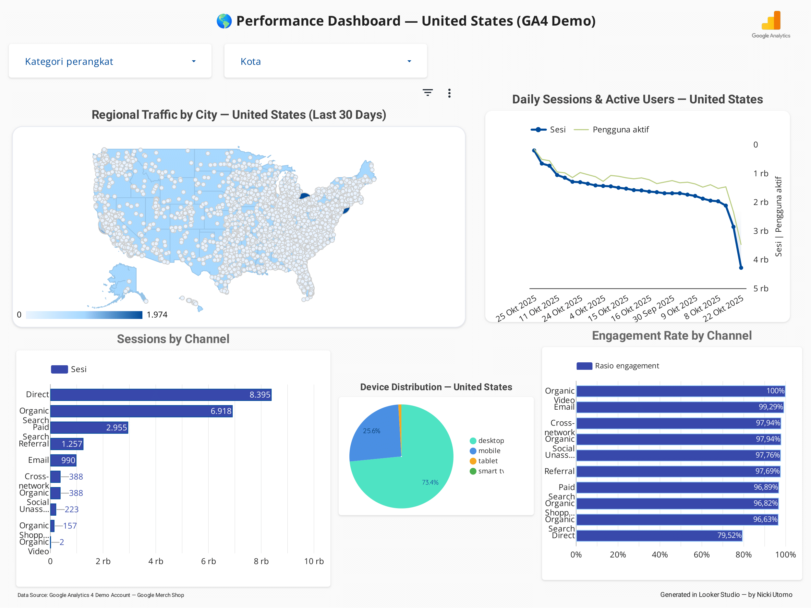

# 🌎 GA4 Regional Performance Dashboard

An interactive **Google Analytics 4 (GA4)** dashboard visualizing **regional web traffic and engagement trends** across the **United States** — built entirely in **Looker Studio**.

🔗 **[View the Live Dashboard →](https://lookerstudio.google.com/s/tMPLrp0ZofM)**  
📅 *Data Source: GA4 Demo Account — Google Merch Shop (Last 30 Days)*  

---

## 🧭 Overview
This project demonstrates how GA4 data can be transformed into a professional, interactive dashboard for performance tracking and data storytelling.  
The dashboard presents a comprehensive overview of **user behavior**, **traffic sources**, and **engagement quality** across U.S. regions.

### Key Visual Components:
- 🗺 **Regional Traffic by City** — city-level heatmap visualizing session density  
- 📈 **Daily Sessions & Active Users** — time series trend for engagement consistency  
- 📊 **Sessions by Channel** — acquisition breakdown by Direct, Organic, Paid, and Referral  
- 📱 **Device Distribution** — ratio of desktop vs mobile vs tablet users  
- 💬 **Engagement Rate by Channel** — performance indicator for traffic quality  

---

## 🧠 Insights Summary
1. **Mobile users dominate** with ~73.5% of total sessions, confirming a strong mobile-first trend.  
2. **Direct traffic** remains the top acquisition channel (8.3K sessions), followed by **Organic Search** (6.9K).  
3. Engagement quality is consistently high across all channels — especially **Organic Video** and **Email** (both ≈100%).  
4. Slight decline in user activity observed in late October, indicating possible seasonal fluctuation.  
5. Referral and social channels maintain moderate volume but strong engagement, suggesting high-quality audiences.  

---

## ⚙️ Tech Stack
| Tool | Function |
|------|-----------|
| **Google Analytics 4 (GA4)** | Web traffic data collection |
| **Looker Studio** | Dashboard visualization |
| **BigQuery (optional)** | Data warehousing (for scalable queries) |
| **GitHub** | Portfolio hosting & version control |

---

## 📸 Dashboard Preview

---

## 👩‍💻 Author
**Nicki Utomo**  
Data Analyst & Visualization Enthusiast  
📧 nickiutomo@gmail.com
🌐 [LinkedIn](https://www.linkedin.com/in/nickiutomo/))

---

> ✨ *Generated in Looker Studio — by Nicki Utomo*
